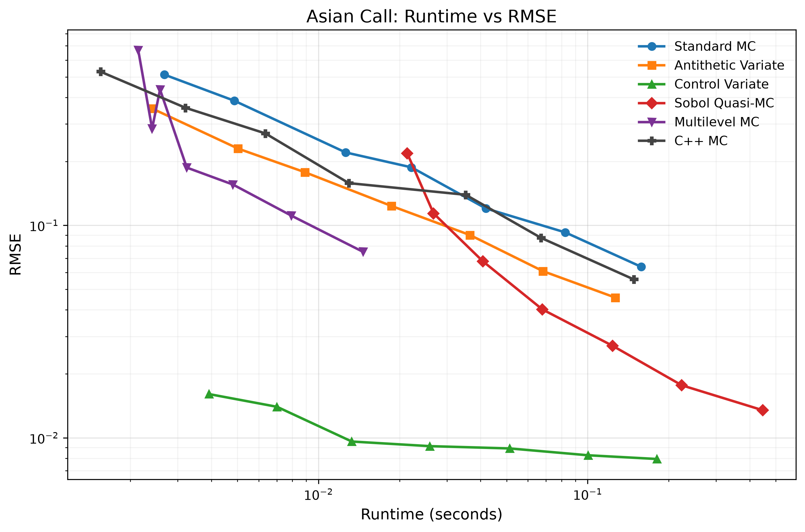
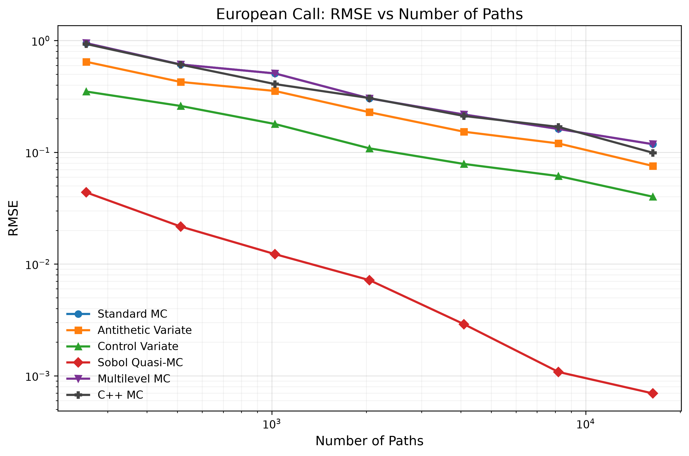
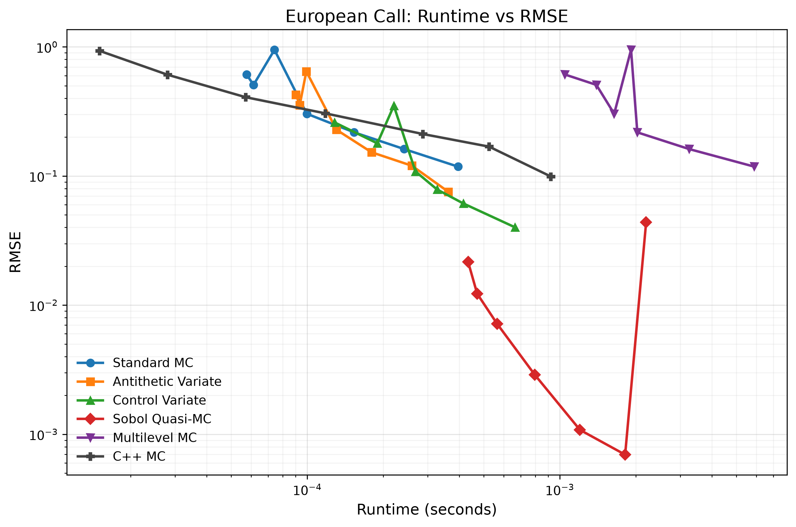
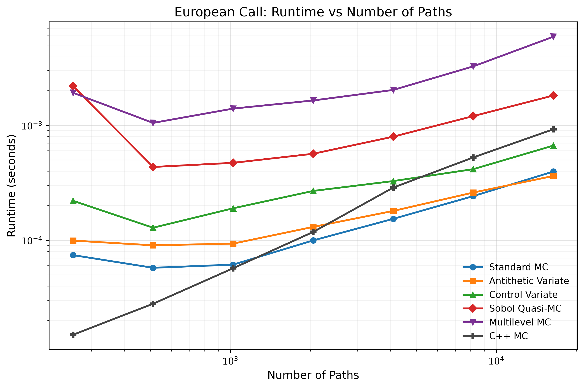
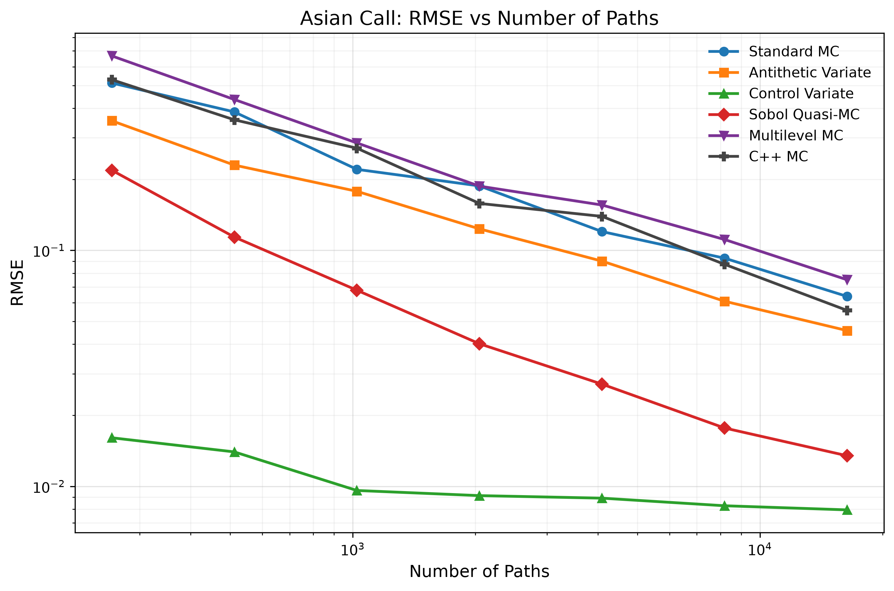
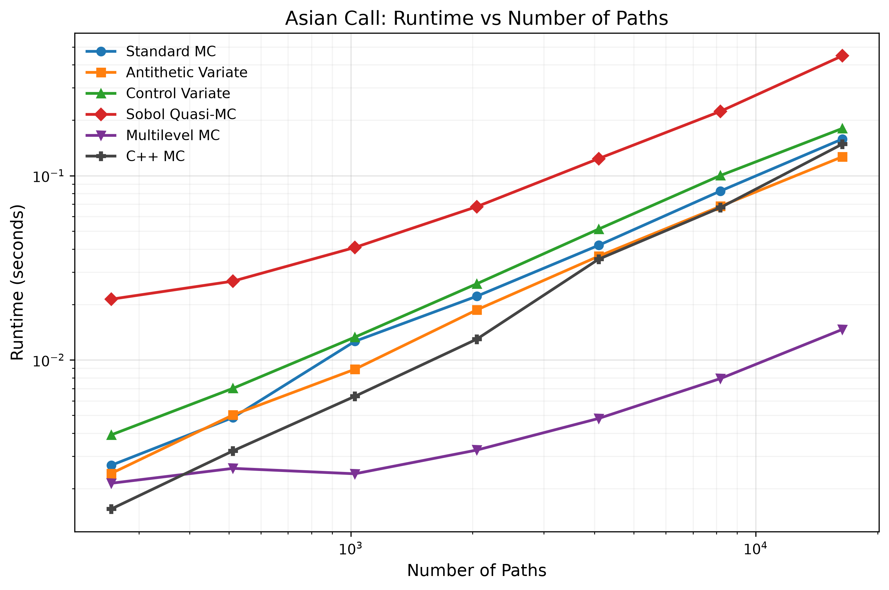

# **Statistical and Computational Efficiency in Monte Carlo Option Pricing**

[](https://www.python.org/)
[](https://isocpp.org/)
[](https://docs.conda.io/)
[](LICENSE)

A comparative study of Monte Carlo methods for European and Asian option pricing, evaluating variance reduction techniques, Sobol quasi-Monte Carlo, multilevel Monte Carlo, and a C++ benchmark implementation.

The project was developed to investigate which Monte Carlo techniques provide the best balance between pricing accuracy and computational efficiency under a common experimental framework.

## Overview

This project studies the trade-off between statistical accuracy and computational cost in Monte Carlo option pricing. It compares standard Monte Carlo against antithetic variates, control variates, Sobol quasi-Monte Carlo, multilevel Monte Carlo, and a C++ implementation, using European and Asian call options as test cases.

The repository includes automated experiments, repeated replications, summary statistics, runtime benchmarking, comparison plots, and a full written report in `report/report.pdf`.

<p align="center">
   
</p>

<p align="center">
<i>Runtime versus RMSE across Monte Carlo methods for Asian call pricing.</i>
</p>

## Key Features

* European call pricing under the Black–Scholes model
* Arithmetic Asian call pricing
* Standard Monte Carlo simulation
* Antithetic variates
* Control variates using:
    * discounted terminal stock prices for European options
    * geometric Asian option payoffs for Asian options
* Sobol quasi-Monte Carlo sampling
* Multilevel Monte Carlo
* Vectorised Python implementation
* C++ benchmark implementation
* Automated experiment pipeline
* CSV outputs and plots
* Full report

## Methods Implemented

### Standard Monte Carlo
Baseline estimator using pseudo-random sampling.

### Antithetic Variates
Reduces variance by pairing each sample with its negative counterpart.

### Control Variates
Uses correlated quantities with known expectations to reduce estimator variance.

### Sobol Quasi-Monte Carlo
Uses low-discrepancy Sobol sequences instead of pseudo-random sampling.

### Multilevel Monte Carlo
Combines simulations at multiple discretisation levels to reduce computational cost.

### C++ Benchmark
A lower-level implementation used to compare performance against the Python version.

## Mathematical Model

The underlying asset is modelled by geometric Brownian motion under the risk-neutral measure:

$$
dS_t = rS_t\,dt + \sigma S_t\,dW_t
$$

European call prices are benchmarked against the analytical Black–Scholes formula. Asian call prices are benchmarked against a high-precision Monte Carlo reference estimate.

## Experimental Evaluation

Each method is evaluated over 100 independent replications across increasing numbers of Monte Carlo paths (from $2^{8}$ to $2^{14}$ paths).

Performance is compared using:

- RMSE vs Number of paths
- Runtime vs RMSE trade-offs
- Runtime vs Number of paths

Summary figures and data are generated automatically and stored under `results/`.

## Repository Structure

```text
├── src/
│   ├── config.py
│   ├── models.py
│   ├── antithetic_variates.py
│   ├── control_variates.py
│   ├── quasi_monte_carlo.py
│   ├── multilevel_monte_carlo.py
│   ├── experiments.py
│   ├── benchmarks.py
│   └── plotting.py
├── cpp/
│   └── option_pricer.cpp
├── results/
│   ├── data/
│   └── figures/
├── report/
│   ├── report.tex
│   └── report.pdf
├── .gitignore
├── environment.yml
├── LICENSE
├── run.py
└── README.md
```

## Installation

```bash
git clone https://github.com/WilliamTDavies/mc-option-pricing-efficiency
cd mc-option-pricing-efficiency
conda env create -f environment.yml
conda activate mc-option-pricing
```

If you prefer to manage dependencies manually, the same environment specification is provided in `environment.yml`.

## Usage

Run the full experimental pipeline:

```bash
python run.py
```

This will:

* run all pricing experiments,
* compile and execute the C++ benchmark,
* save summary CSV files,
* generate plots in `results/figures/`.

## Outputs

The project produces:

* comparison plots for European and Asian options,
* runtime and accuracy benchmarks,
* C++ performance comparisons.

A full written report can be found in  `report/report.pdf`.


## Results

The experiments compare statistical accuracy and computational cost across all implemented methods for both European and Asian call options.

Representative outputs include:

### European call options
RMSE convergence, runtime–accuracy trade-off, and runtime scaling.
<p align="center">
  
  
  
</p>

### Asian call options
RMSE convergence, runtime–accuracy trade-off, and runtime scaling.
<p align="center">
  
  
  
</p>

Key observations:

- Sobol QMC gave the strongest accuracy improvement for the European option.
- Control variates were the best classical variance-reduction method for both European and Asian options.
- Antithetic variates improved over standard MC, but less dramatically than control variates.
- MLMC reduced runtime in the Asian case, but did not dominate the other methods on accuracy.
- The C++ benchmark showed that implementation language alone did not consistently outperform well-vectorised Python.

## Notes

* The European benchmark price is exact via Black–Scholes.
* The Asian reference price is estimated using a high-precision Monte Carlo run with five million paths, making its Monte Carlo uncertainty effectively negligible relative to the errors being compared.
* The MLMC implementation uses a simplified fixed-level allocation rather than a fully adaptive Giles-style allocator.
* The C++ benchmark is intended as a practical performance comparison, not a heavily optimised production engine.

## Future Improvements

Possible extensions include:

- Adaptive MLMC sample allocation
- Barrier and lookback option pricing
- GPU acceleration
- Parallel Monte Carlo simulation

## References

1. Black, F. & Scholes, M. (1973). *The Pricing of Options and Corporate Liabilities.* Journal of Political Economy.
   https://doi.org/10.1086/260062

2. Glasserman, P. (2004). *Monte Carlo Methods in Financial Engineering.*
   https://link.springer.com/book/10.1007/978-0-387-21617-1

3. Giles, M. B. (2008). *Multilevel Monte Carlo Path Simulation.*
   https://people.maths.ox.ac.uk/gilesm/files/OPRE_2008.pdf

4. Sobol, I. M. (1967). *On the Distribution of Points in a Cube and the Approximate Evaluation of Integrals.*
   https://doi.org/10.1016/0041-5553(67)90144-9

5. Art B. Owen (1998). *Scrambling Sobol' and Niederreiter–Xing Points.* Journal of Complexity.
   https://doi.org/10.1006/jcom.1998.0487

6. Caflisch, R. E. (1998). *Monte Carlo and Quasi-Monte Carlo Methods.* Acta Numerica.
   https://doi.org/10.1017/S0962492900002804